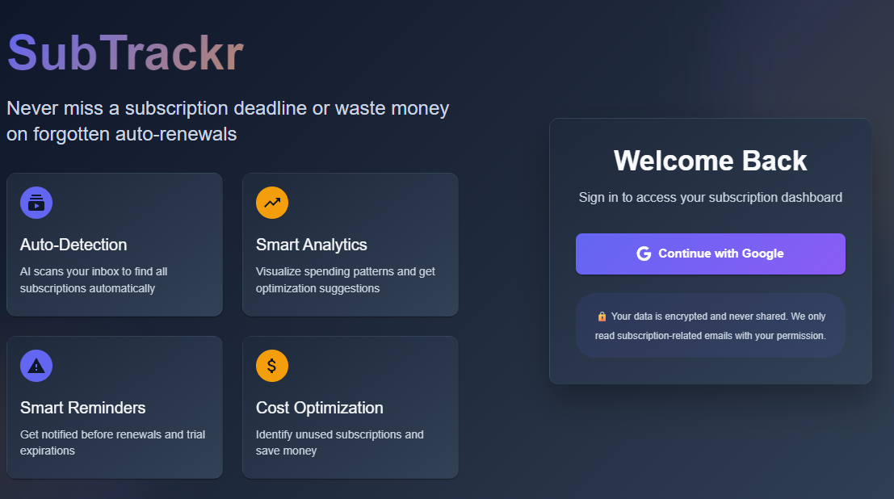

# SubTrackr

A subscription tracker I built to help manage all those monthly payments that add up quickly.



## What it does

- Track all your subscriptions in one place
- See spending trends with charts
- Get reminders before renewals  
- Dark theme that's easy on the eyes
- Google login for quick access

## Built with

React, TypeScript, Material-UI, Node.js, Express, MongoDB

## Setup

```bash
git clone https://github.com/devndesigner6/SubTrackr.git
cd SubTrackr
npm install
cd server && npm install
```

Copy the `.env.example` files and add your MongoDB URL and Google OAuth keys.

```bash
npm run dev        # frontend
npm run server     # backend
```

Open http://localhost:5173

## Why I built this

Got tired of forgetting about subscriptions and finding surprise charges on my card. Wanted something simple to track everything without the bloat of other apps.

## Contact

peddadahemanth6@gmail.com

---

Built by Hemanth Peddada
